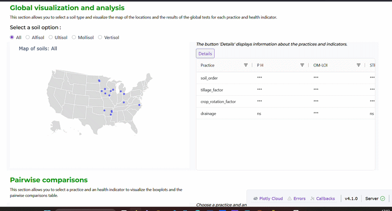

# Management practices and soil heath : An Interactive EDA dashboard application
This project explores a field trials dataset using Python dashboard. The dataset used studies the impact of different agricultural practices on soil health in soybean-based crop systems across different soil and geographical conditions in the US.

# Visual demo


# Description
This project is an interactive Dash application to analyze how agricultural management practices affects soil health across 17 locations in the US.

# Key features
## Visuals
Identify spatial trends in soil health across the 17 locations using an **interactive bubble map**, with deep-dives into distribution variance via linked **boxplots**.

## Tables
Provide an automated statistical backend that selects between Kruskal-Wallis or One-way ANOVA based on distribution normality (tested with Shapiro-Wilk test and Barlette test), providing instant **p-value** significance for soil order and management effects.
- The **Geo and soil conditions effects** table tests the effects of each condition (soil order, texture class, state) on each indicator, if the condition has at least 2 levels.
- The **Site effects** table tests the effects of the variability between sites on each indicator for each condition level, if the level has at least 2 sites. (ex: if the condition is soil order, and the levels are Mollisol and Alfisol, if Mollisol has two sites and Alfisol one site, the test will be performed on Mollisol).

# Installation and usage
1. Install dependencies
```bash
pip install dash plotly pandas
```
2. Download the repository
3. Run the app
```bash
python app.py
```
A browser tab will open, displaying the dashboard.

# Resources
The data used are from the **study** https://doi.org/10.1016/j.agee.2025.109950
Geospatial coordinates were geocoded based on the location metadata and verified against USDA site records.

For interpretations, the usda soil taxonomy is used as **reference** https://www.nrcs.usda.gov/resources/education-and-teaching-materials/the-twelve-orders-of-soil-taxonomy

# Data and methodology
## Data
### Soil health indicators
* **Chemical/Physical** : pH, organic matter loss-on-ignition (OM-LOI), total nitrogen (TN), soil test phosphorus (STP), and soil test potassium (STK).
* **Biological/Carbon** : Wet aggregate stability (WAS), permanganate oxidizable carbon (POXC), mineralizable carbon (Min-C), water extractable organic carbon (WEOC), total organic carbon (TOC), and soil extractable protein (ACE-N).

### Management practices
* **Crop rotation**
* **Tillage**
* **Cover cropping**
* **Artificial drainage**

## Methodology
Agricultural field trials often suffer from unbalanced designs (e.g., specific tillage practices only tested in one soil order). This dashboard addresses this by dynamically filtering statistical tests to only those conditions with sufficient sample sizes (n≥2), preventing misleading interpretations of site-specific variance.
